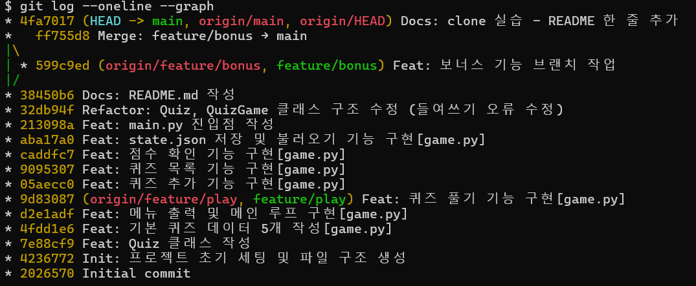
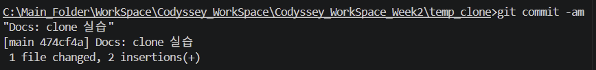
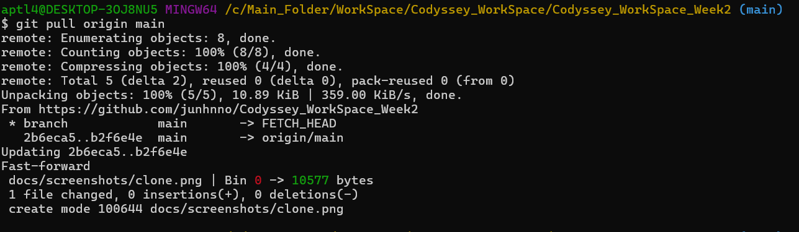

# 나는 어떤 사람일까요?

## 프로젝트 개요
'황준호'에 관한 정보를 퀴즈로 맞추는 터미널 기반 퀴즈 게임입니다.
퀴즈 풀기, 추가, 삭제, 목록 확인, 점수 확인 기능을 제공하며
프로그램을 종료해도 데이터가 유지됩니다.

## 퀴즈 주제 선정 이유
나에 대한 정보를 퀴즈로 만들어 동료들이 나를 더 잘 알아갈 수 있도록 주제를 선정했습니다.

## 실행 방법
```bash
python main.py
```

## 기능 목록
| 기능 | 설명 |
|------|------|
| 퀴즈 풀기 | 저장된 퀴즈를 순서대로 풀고 결과 확인 |
| 퀴즈 추가 | 새로운 퀴즈를 등록하고 파일에 저장 |
| 퀴즈 삭제 | 등록된 퀴즈를 삭제하고 파일에 반영 |
| 퀴즈 목록 | 등록된 퀴즈 전체 목록 확인 |
| 점수 확인 | 최고 점수 확인 |

## 파일 구조
```
quiz-game/
├── main.py       # 진입점
├── quiz.py       # Quiz 클래스
├── game.py       # QuizGame 클래스
├── state.json    # 데이터 저장 파일 (자동 생성)
├── .gitignore
└── README.md
```

## GitHub 저장소
https://github.com/junhnno/Codyssey_WorkSpace_Week2

## Git 커밋 전략
기능 단위로 커밋하여 변경 이력을 명확하게 관리했습니다.
커밋 메시지는 아래 형식을 따랐습니다.

- `Init` : 프로젝트 초기 세팅
- `Feat` : 새로운 기능 구현
- `Fix` : 버그 수정
- `Refactor` : 코드 구조 개선
- `Docs` : 문서 작성 및 수정
- `Merge` : 브랜치 병합

커밋은 총 18개 이상이며 `git log --oneline --graph` 결과는 아래와 같습니다.



## 브랜치 전략
기능 단위로 브랜치를 분리하여 작업한 뒤 `--no-ff` 옵션으로 병합했습니다.
`--no-ff`를 사용한 이유는 병합 커밋을 명시적으로 남겨 브랜치 작업 기록을 보존하기 위해서입니다.

- `feature/play` : 퀴즈 풀기 기능 개발
- `feature/bonus` : 보너스 기능 개발
- `feature/delete` : 퀴즈 삭제 기능 개발

브랜치를 분리하는 이유는 main 브랜치를 항상 안정적인 상태로 유지하고,
기능 개발 중 오류가 발생해도 main에 영향을 주지 않기 위해서입니다.

## clone/pull 실습
별도의 로컬 디렉터리에 저장소를 clone한 뒤 변경사항을 commit/push하고,
기존 작업 디렉터리에서 pull로 변경사항을 가져오는 실습을 수행했습니다.




## 코드 구조 설계 이유

### 클래스를 사용한 이유
함수만으로 구현할 경우 데이터(퀴즈 목록, 점수)를 전역 변수로 관리해야 합니다.
클래스를 사용하면 데이터와 관련 동작을 하나의 단위로 묶어 관리할 수 있고,
코드의 가독성과 유지보수성이 높아집니다.

### 클래스 책임 분리 기준
- `Quiz` 클래스 : 개별 퀴즈 데이터(문제, 선택지, 정답)를 표현합니다. 정답 확인, 출력, JSON 변환 등 퀴즈 단위의 책임만 담당합니다.
- `QuizGame` 클래스 : 게임 전체 흐름을 관리합니다. 메뉴 출력, 퀴즈 풀기, 추가, 삭제, 저장, 불러오기 등 게임 단위의 책임을 담당합니다.

두 클래스로 분리한 이유는 데이터 표현과 게임 로직을 분리하여 각 클래스가 하나의 책임만 갖도록 하기 위해서입니다.
예를 들어 퀴즈 출력 방식이 바뀌면 `Quiz` 클래스만, 메뉴 구조가 바뀌면 `QuizGame` 클래스만 수정하면 됩니다.

### 메서드 분리 기준
기능별로 메서드를 분리하여 각 메서드가 하나의 역할만 수행하도록 했습니다.

| 메서드 | 역할 |
|--------|------|
| `show_menu()` | 메뉴 출력 |
| `play()` | 퀴즈 풀기 진행 |
| `add_quiz()` | 퀴즈 추가 |
| `delete_quiz()` | 퀴즈 삭제 |
| `show_list()` | 퀴즈 목록 출력 |
| `show_score()` | 점수 확인 |
| `save()` | state.json 저장 |
| `load()` | state.json 불러오기 |

## 데이터 파일 설명 (state.json)
- **경로** : 프로젝트 루트/state.json
- **역할** : 퀴즈 데이터와 최고 점수를 저장하여 프로그램 종료 후에도 데이터 유지
- **인코딩** : UTF-8

### 스키마
```json
{
    "quizzes": [
        {
            "question": "준호의 키는?",
            "choices": ["175cm", "177cm", "179cm", "181cm"],
            "answer": 3
        }
    ],
    "best_score": 80
}
```

### 스키마 설계 이유
- `quizzes` : 퀴즈 목록을 배열로 저장하여 퀴즈 추가/삭제가 용이하도록 설계했습니다.
- `best_score` : 최고 점수를 별도 키로 관리하여 퀴즈 데이터와 독립적으로 갱신할 수 있도록 했습니다.

### state.json 읽기/쓰기 흐름
```
프로그램 시작
    ↓
load() 호출
    ↓
state.json 존재? ──No──→ 기본 퀴즈 데이터로 시작
    ↓ Yes
JSON 파싱 성공? ──No──→ 손상 안내 후 기본 데이터로 초기화
    ↓ Yes
퀴즈 목록, 최고 점수 불러오기
    ↓
게임 진행 (퀴즈 추가/삭제/풀기)
    ↓
save() 호출 → state.json에 저장
```

## JSON 저장 방식을 선택한 이유
- 외부 라이브러리 없이 Python 표준 라이브러리(`json`)만으로 사용 가능합니다.
- 사람이 읽기 쉬운 텍스트 형식으로 데이터를 확인하고 수정하기 편리합니다.
- 소규모 데이터 저장에 적합합니다.

## JSON 저장 방식의 한계
데이터가 1000개 이상으로 늘어날 경우 아래와 같은 한계가 있습니다.

- **성능 저하** : 저장/불러오기 시 파일 전체를 읽고 써야 하므로 데이터가 많을수록 속도가 느려집니다.
- **동시 접근 불가** : 여러 사용자가 동시에 접근할 경우 데이터 충돌이 발생할 수 있습니다.
- **검색 비효율** : 특정 데이터를 찾으려면 전체를 순회해야 합니다.
- **대안** : 데이터가 많아질 경우 SQLite 등의 데이터베이스 사용을 고려할 수 있습니다.

## 파일 손상 시 복구 전략
`state.json`이 손상된 경우 아래와 같이 처리합니다.

1. `json.JSONDecodeError` 또는 `KeyError` 발생 시 안내 메시지를 출력합니다.
2. 손상된 파일 대신 기본 퀴즈 데이터(`DEFAULT_QUIZZES`)로 초기화합니다.
3. 프로그램이 정상적으로 계속 실행됩니다.

```python
except (json.JSONDecodeError, KeyError):
    print("⚠️ 데이터 파일이 손상되었습니다. 기본 퀴즈 데이터로 초기화합니다.")
    self.quizzes = DEFAULT_QUIZZES[:]
    self.best_score = 0
```

## try/except 사용 이유
- 파일이 없거나 손상된 경우 프로그램이 비정상 종료되는 것을 방지합니다.
- 사용자가 Ctrl+C(`KeyboardInterrupt`)로 강제 종료해도 데이터를 안전하게 저장합니다.
- 입력 스트림 종료(`EOFError`) 상황에서도 안전하게 종료합니다.

## 요구사항 변경 시 수정 포인트
| 변경 사항 | 수정 파일 | 수정 위치 |
|-----------|-----------|-----------|
| 퀴즈에 힌트 추가 | `quiz.py` | `Quiz.__init__`, `Quiz.display`, `Quiz.to_dict`, `Quiz.from_dict` |
| 점수 계산 방식 변경 | `game.py` | `QuizGame.play` |
| 저장 파일 형식 변경 | `game.py` | `QuizGame.save`, `QuizGame.load` |
| 메뉴 항목 추가 | `game.py` | `QuizGame.show_menu`, `QuizGame.run` |
| 기본 퀴즈 데이터 변경 | `game.py` | `DEFAULT_QUIZZES` |

## 코드

### main.py
```python
from game import QuizGame

if __name__ == "__main__":
    game = QuizGame()
    game.load()
    game.run()
```

### quiz.py
```python
class Quiz:
    def __init__(self, question, choices, answer):
        self.question = question
        self.choices = choices
        self.answer = answer

    def display(self):
        print(f"\n{self.question}\n")
        for i, choice in enumerate(self.choices, start=1):
            print(f"  {i}. {choice}")

    def check_answer(self, user_input):
        return user_input == self.answer

    def to_dict(self):
        return {
            "question": self.question,
            "choices": self.choices,
            "answer": self.answer
        }

    @staticmethod
    def from_dict(data):
        return Quiz(
            question=data["question"],
            choices=data["choices"],
            answer=data["answer"]
        )
```

### game.py
```python
import json
import os
from quiz import Quiz

DEFAULT_QUIZZES = [
    Quiz(
        question="준호의 키는?",
        choices=["175cm", "177cm", "179cm", "181cm"],
        answer=3
    ),
    Quiz(
        question="준호가 가장 좋아하는 음식은?",
        choices=["삼겹살", "족발", "치킨", "라면"],
        answer=4
    ),
    Quiz(
        question="준호의 폰 케이스 캐릭터는?",
        choices=["라이언", "패트와 매트", "미니언즈", "스폰지밥"],
        answer=2
    ),
    Quiz(
        question="준호가 가장 잘하는 스포츠는?",
        choices=["볼링", "농구", "당구", "탁구"],
        answer=3
    ),
    Quiz(
        question="준호가 나온 군대는?",
        choices=["육군", "공군", "해군", "해병대"],
        answer=4
    ),
]

class QuizGame:
    def __init__(self):
        self.quizzes = DEFAULT_QUIZZES[:]
        self.best_score = 0

    def show_menu(self):
        print("\n========================================")
        print("         나는 어떤 사람일까요? ")
        print("========================================")
        print("1. 퀴즈 풀기")
        print("2. 퀴즈 추가")
        print("3. 퀴즈 삭제")
        print("4. 퀴즈 목록")
        print("5. 점수 확인")
        print("6. 종료")
        print("========================================")

    def run(self):
        while True:
            try:
                self.show_menu()
                choice = input("선택: ").strip()

                if choice == "":
                    print("⚠️ 입력값이 없습니다. 1-6 사이의 숫자를 입력하세요.")
                    continue
                if not choice.isdigit():
                    print("⚠️ 잘못된 입력입니다. 1-6 사이의 숫자를 입력하세요.")
                    continue

                choice = int(choice)

                if choice == 1:
                    self.play()
                elif choice == 2:
                    self.add_quiz()
                elif choice == 3:
                    self.delete_quiz()
                elif choice == 4:
                    self.show_list()
                elif choice == 5:
                    self.show_score()
                elif choice == 6:
                    print("게임을 종료합니다.")
                    self.save()
                    break
                else:
                    print("⚠️ 잘못된 입력입니다. 1-6 사이의 숫자를 입력하세요.")

            except KeyboardInterrupt:
                print("\n\n프로그램을 종료합니다.")
                self.save()
                break
            except EOFError:
                print("\n\n입력 스트림이 종료되었습니다.")
                self.save()
                break

    def play(self):
        if not self.quizzes:
            print("⚠️ 등록된 퀴즈가 없습니다.")
            return

        print(f"\n📝 퀴즈를 시작합니다! (총 {len(self.quizzes)}문제)")
        score = 0

        for i, quiz in enumerate(self.quizzes, start=1):
            print(f"\n----------------------------------------")
            print(f"[문제 {i}]")
            quiz.display()

            while True:
                try:
                    user_input = input("\n정답 입력: ").strip()

                    if user_input == "":
                        print("⚠️ 입력값이 없습니다. 1-4 사이의 숫자를 입력하세요.")
                        continue
                    if not user_input.isdigit():
                        print("⚠️ 잘못된 입력입니다. 1-4 사이의 숫자를 입력하세요.")
                        continue

                    user_input = int(user_input)

                    if user_input < 1 or user_input > 4:
                        print("⚠️ 잘못된 입력입니다. 1-4 사이의 숫자를 입력하세요.")
                        continue

                    break

                except KeyboardInterrupt:
                    print("\n\n퀴즈를 종료합니다.")
                    self.save()
                    return

            if quiz.check_answer(user_input):
                print("✅ 정답입니다!")
                score += 1
            else:
                print(f"❌ 오답입니다! 정답은 {quiz.answer}번입니다.")

        total = len(self.quizzes)
        percent = int(score / total * 100)

        print(f"\n========================================")
        print(f"🏆 결과: {total}문제 중 {score}문제 정답! ({percent}점)")

        if percent > self.best_score:
            self.best_score = percent
            print("🎉 새로운 최고 점수입니다!")

        print(f"========================================")
        self.save()

    def add_quiz(self):
        print("\n📌 새로운 퀴즈를 추가합니다.")

        question = input("문제를 입력하세요: ").strip()
        if question == "":
            print("⚠️ 문제를 입력해야 합니다.")
            return

        choices = []
        for i in range(1, 5):
            while True:
                choice = input(f"선택지 {i}: ").strip()
                if choice == "":
                    print("⚠️ 선택지를 입력해야 합니다.")
                    continue
                choices.append(choice)
                break

        while True:
            try:
                answer = input("정답 번호 (1-4): ").strip()

                if answer == "":
                    print("⚠️ 입력값이 없습니다. 1-4 사이의 숫자를 입력하세요.")
                    continue
                if not answer.isdigit():
                    print("⚠️ 잘못된 입력입니다. 1-4 사이의 숫자를 입력하세요.")
                    continue

                answer = int(answer)

                if answer < 1 or answer > 4:
                    print("⚠️ 잘못된 입력입니다. 1-4 사이의 숫자를 입력하세요.")
                    continue

                break

            except KeyboardInterrupt:
                print("\n\n퀴즈 추가를 취소합니다.")
                return

        new_quiz = Quiz(question, choices, answer)
        self.quizzes.append(new_quiz)
        self.save()
        print("✅ 퀴즈가 추가되었습니다!")

    def delete_quiz(self):
        if not self.quizzes:
            print("⚠️ 등록된 퀴즈가 없습니다.")
            return

        self.show_list()

        while True:
            try:
                number = input("\n삭제할 퀴즈 번호를 입력하세요: ").strip()

                if number == "":
                    print("⚠️ 입력값이 없습니다.")
                    continue
                if not number.isdigit():
                    print("⚠️ 잘못된 입력입니다. 숫자를 입력하세요.")
                    continue

                number = int(number)

                if number < 1 or number > len(self.quizzes):
                    print(f"⚠️ 잘못된 입력입니다. 1-{len(self.quizzes)} 사이의 숫자를 입력하세요.")
                    continue

                break

            except KeyboardInterrupt:
                print("\n\n퀴즈 삭제를 취소합니다.")
                return

        deleted = self.quizzes.pop(number - 1)
        self.save()
        print(f"✅ [{deleted.question}] 퀴즈가 삭제되었습니다!")

    def show_list(self):
        if not self.quizzes:
            print("⚠️ 등록된 퀴즈가 없습니다.")
            return

        print(f"\n📋 등록된 퀴즈 목록 (총 {len(self.quizzes)}개)")
        print("----------------------------------------")
        for i, quiz in enumerate(self.quizzes, start=1):
            print(f"[{i}] {quiz.question}")
        print("----------------------------------------")

    def show_score(self):
        if self.best_score == 0:
            print("\n⚠️ 아직 퀴즈를 풀지 않았습니다.")
            return

        print(f"\n🏆 최고 점수: {self.best_score}점")

    def save(self):
        try:
            data = {
                "quizzes": [quiz.to_dict() for quiz in self.quizzes],
                "best_score": self.best_score
            }
            with open("state.json", "w", encoding="utf-8") as f:
                json.dump(data, f, ensure_ascii=False, indent=4)
        except Exception as e:
            print(f"⚠️ 저장 중 오류가 발생했습니다: {e}")

    def load(self):
        if not os.path.exists("state.json"):
            print("📂 기본 퀴즈 데이터로 시작합니다.")
            return

        try:
            with open("state.json", "r", encoding="utf-8") as f:
                data = json.load(f)
            self.quizzes = [Quiz.from_dict(q) for q in data["quizzes"]]
            self.best_score = data["best_score"]
            print(f"📂 저장된 데이터를 불러왔습니다. (퀴즈 {len(self.quizzes)}개, 최고점수 {self.best_score}점)")
        except (json.JSONDecodeError, KeyError):
            print("⚠️ 데이터 파일이 손상되었습니다. 기본 퀴즈 데이터로 초기화합니다.")
            self.quizzes = DEFAULT_QUIZZES[:]
            self.best_score = 0
        except Exception as e:
            print(f"⚠️ 불러오기 중 오류가 발생했습니다: {e}")
```

## 감사합니다!